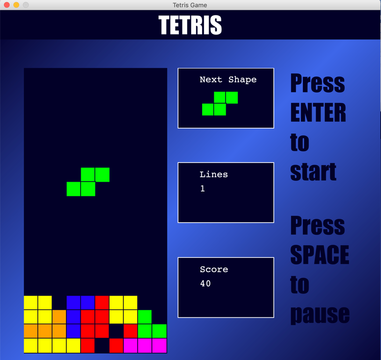

# Java-TetrisGame

A program which was derived from the classic game of Tetris. The application was designed in an object-oriented programming style and relies on both event handling and the use of objects. 

### Utilized

- NetBeans 
- Java 
- CSS

### Screen Shot 

